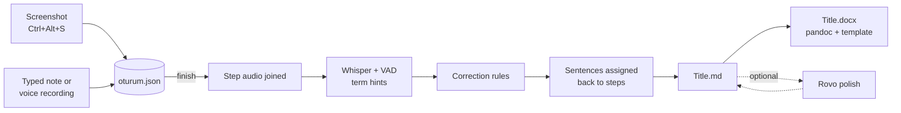

# adımadım

**English** · [Türkçe](README.tr.md)


> **adımadım: click through the screens, narrate, get a finished use-case document.**

---

## 📌 About the Project

Business analysts document how an application is used by writing use-case scenarios: take a
screenshot of every screen, paste it into a document, describe what happens, then clean it all up.
It is slow, repetitive work, and the screens often contain customer data that must not be sent to a
cloud service. Speech-to-text could speed it up, but the narration here is Turkish mixed with English
telecom/BSS terms ("Device Upgrade", "Order Summary", "SIM swap"), which general speech models get wrong.

adımadım ("step by step" in Turkish) turns the job into a single pass. You demonstrate the flow once,
capture each screen with a shortcut and describe it by voice or keyboard; when you finish, an ordered
Markdown and Word document is ready. Speech recognition runs entirely on the local machine and is
tuned for domain terms with hints, correction rules and whole-session transcription, each step
chosen by measurement rather than guesswork.

## ✨ Key Features

* **One-shortcut capture:** `Ctrl+Alt+S` captures the active window (or full screen) from any application and asks for the step's note; `Ctrl+Alt+N` edits the last note.
* **Voice narration, transcribed locally:** Whisper medium via OpenVINO on Intel CPU/GPU/NPU, with automatic fallback to faster-whisper. Nothing leaves the machine.
* **Domain-term accuracy:** term hints, a suffix-preserving "wrong → right" correction dictionary and Silero VAD lift the term hit rate from 67% to 90%. Company-specific terms stay in `.local` files outside the repo.
* **Whole-session transcription:** all step recordings are transcribed together and each sentence is assigned back to its step, cutting WER on a real session from 93% to 7.6%.
* **Built-in image editor:** crop, box, arrow and text annotations on any screenshot; the original is kept.
* **API calls per step:** export the browser's Network log as HAR and each JSON/XML call lands under the step it belongs to (GET → the screen that shows the data, POST/PUT/DELETE → the screen whose button sent it), with tokens, cookies and configured fields masked. Load the workflow command table (DBeaver copy or CSV/TXT) and each workflow call also lists the commands that ran: the current state's post commands and the next state's pre commands.
* **Document output:** Markdown (live in Obsidian) plus Word through pandoc and an optional company template; paste back an Atlassian Rovo-polished version and both files update.

## 🛠 Tech Stack

* **Language:** Python 3.10 (single CLI entry point `adimadim.py`), Bash (`kur.sh`, `test.sh`)
* **UI:** tkinter (always-on-top window), Pillow (image editor), zenity and libnotify (dialogs, notifications), GNOME custom shortcuts
* **Speech / AI:** OpenAI Whisper medium converted with optimum-intel 2.2 and run by OpenVINO GenAI 2026.4; faster-whisper fallback; Silero VAD; Atlassian Rovo for formal wording (optional, outside the tool)
* **Data:** files only: `oturum.json` per session, PNG screenshots, WAV recordings, Markdown and DOCX
* **System:** gnome-screenshot, arecord (ALSA), pandoc

## 🏗 Architecture and Data Flow



1. **Capture:** each shortcut press or button click saves a screenshot and, in voice mode, closes the previous step's recording and starts a new one. `oturum.json` is the single source of truth; the Markdown is regenerated from it on every change.
2. **Transcribe:** on finish, all step recordings are concatenated. Silero VAD removes silence (timestamps are mapped back to the original audio), Whisper transcribes with a prompt built from the term lists, and the correction dictionary is applied.
3. **Assign:** every timestamped sentence goes to the step in which it started.
4. **Render:** Markdown in a use-case template, then Word via pandoc with the company template.
5. **Polish (optional):** the Markdown is copied to Rovo; the formal version pasted back replaces the .md (previous one kept as `.md.yedek`), with screenshots and step headings restored, and Word is rebuilt.

The window (`arayuz.py`) only runs the same CLI commands in a subprocess and polls `oturum.json`, so
the command line and the UI always behave the same.

## 🚀 Quick Start

**Prerequisites:** Ubuntu 22.04 (GNOME), Python 3.10, git, sudo for `apt-get`. An Intel GPU/NPU is optional.

```bash
git clone https://github.com/miracmenekse/adimadim.git
cd adimadim
./kur.sh     # apt packages, Python venv, Whisper → OpenVINO conversion, command, shortcuts, menu entry
./test.sh    # end-to-end check; last line: SONUÇ: testler geçti
```

No environment variables are needed. Settings live in `~/.config/adimadim/ayar.json`, created by
`kur.sh` with the device detected automatically (all keys: [README.tr.md](README.tr.md#ayarlar)).
`kur.sh` is idempotent and never overwrites existing values. To update: `git pull && ./kur.sh && ./test.sh`,
or on the host the **adımadım güncelle** button that `kur.sh` adds to the dock (pull, reinstall if changed, open).

## 💡 Usage & Examples

Open **adımadım** from the application menu: **Start** (title, voice or typed) → **Recording**
(capture, note, undo, region capture, thumbnails) → **Finish** (progress bar, document preview,
copy Markdown, Rovo paste-back, open Word, add API calls from a HAR file). Or use the CLI:

```bash
adimadim basla "Sipariş iptal akışı" --ses   # start a voice-narrated session
# press Ctrl+Alt+S on each screen and describe it
adimadim geri                                 # drop the last capture
adimadim bitir                                # transcribe, build .md + .docx, open the folder
adimadim word                                 # rebuild Word after editing the .md
adimadim yeniden                              # re-transcribe with the current model
adimadim cevir kayit.wav                      # transcribe a single audio file
adimadim api akis.har                         # add API calls from the browser's Network log
adimadim komutlar tablo.csv                   # load the command table: commands run per workflow call
```

**API calls (Firefox):** before the first screen, open F12 → **Network** and tick **Persist Logs** in the gear menu.
When done, right-click in Network → **Save All As HAR**, then **API ekle (HAR)** on the finish screen (before Rovo:
the .md is regenerated, the previous one kept as `.md.yedek`). Headers (Authorization, Cookie) never reach the
document; the HAR is not copied into the session folder; delete it afterwards since it holds session cookies.

**Commands run:** in DBeaver select the command-table query result (Ctrl+A, Ctrl+C), then **Komut tablosu** on the
finish screen (with an empty clipboard it asks for a CSV/TXT/Markdown export). Columns: flow, state, …,
bean_name, is_pre, is_post, sort_id; only this document's flow.

**Output:** a session folder

```
Belgeler/adimadim/Sipariş iptal akışı/
├── oturum.json
├── gorseller/adim-01.png …
├── ses/
├── Sipariş iptal akışı.md
└── Sipariş iptal akışı.docx
```

with a document like this:

```markdown
# Sipariş iptal akışı

- **Tarih:** 2026-09-28
- **Amaç:** …
- **Aktör:** …

## Ana akış

### Adım 1


Müşteri ekranında Order Summary sekmesine geçiyoruz ve iptal edilecek siparişi seçiyoruz.
```

**Measured accuracy** (`testler/stt_olc.py`, `testler/karsilastir.py`; details in `CHANGELOG.md` and `testler/sonuclar/`):

| Change | Result |
|---|---|
| Model choice (29 real recordings) | whisper-medium term hit rate 66.3% vs. 28.4% and 14.7% for two Turkish fine-tuned models |
| Term hint + corrections + VAD | term hit rate 67.4% → 90.5%, WER 29.0% → 16.4%; general Turkish (FLEURS) not degraded |
| Whole-session transcription (real 12-step session) | WER 93.0% → 7.6%, terms 11/11 |

## 🗺 Roadmap

- [x] Screenshot + typed/voice narration → Markdown + Word
- [x] Local Turkish speech recognition with domain-term accuracy layers
- [x] Button window, image editor, Rovo paste-back
- [x] API calls per step from the browser's HAR export
- [x] Commands run per workflow call from the command configuration table
- [ ] Keyboard shortcut for finishing a session
- [ ] Visible recording-duration indicator in voice mode
- [ ] Windows support (under evaluation; screenshots, shortcuts and audio are Linux-specific today)

Full plan and decisions: `YOL_HARITASI.md`, `KARARLAR.md` (Turkish).

## 📄 License & Contributing

No license has been chosen yet; all rights reserved until one is added.

The project is developed with Claude Code in a VM and reaches the machine where it is used only
through tagged releases. Contribution rules: every change passes `./test.sh`; every new feature adds a
check to `testler/duman_testi.py`; accuracy-related changes are measured before and after; no real
company data in the repo. See `CLAUDE.md` and `CALISMA_DUZENI.md`.

## 📈 Development History

How the product evolved, one entry per release. Each pull request adds a row here.

| Version | Date | What changed |
|---|---|---|
| v0.1.0 | 2026-09 | Skeleton: screenshots + typed/spoken narration → .md + .docx. OpenVINO speech recognition with faster-whisper fallback, reproducible `kur.sh`/`test.sh`, VM ↔ host workflow. |
| v0.3.0 | 2026-09-27 | Model decision: whisper-medium stays (Turkish fine-tunes rejected). Accuracy layers: VAD, term hints, correction rules. Rovo agent instructions and glossary. Fixed a locale bug that silently broke the OpenVINO model. |
| v0.3.1 | 2026-09-27 | Relative document folder resolved correctly from the keyboard shortcut. |
| v0.4.0 | 2026-09-28 | Whole-session transcription with sentences assigned back to steps: WER 93% → 7.6% on a real session. |
| v0.4.1 | 2026-09-28 | Word rebuilt from pasted Rovo output with screenshots and step headings restored. |
| v0.5.0 | 2026-09-28 | Button window: the whole flow without a terminal; application menu entry. |
| v0.6.0 | 2026-09-28 | Window redesigned into Start → Recording → Finish screens, with progress bar and thumbnails. |
| v0.7.0 | 2026-09-28 | Region capture and image editor (crop, box, arrow, text); copy Markdown and paste-back Rovo area on the finish screen. |
| v0.8.0 | 2026-10-06 | API calls per step: the browser's Network log (HAR) is matched to screenshots by time and shown as a table plus shortened, masked request/response bodies. |
| v0.9.0 | 2026-10-07 | Commands run per workflow call: the command configuration table (DBeaver copy, CSV, TXT, Markdown) is matched to workflow API calls by current/next state and pre/post flags. |
| v0.9.1 | 2026-10-07 | One-click update on the host: an "adımadım güncelle" dock button pulls the latest code, reinstalls only when it changed and reopens the window. |
