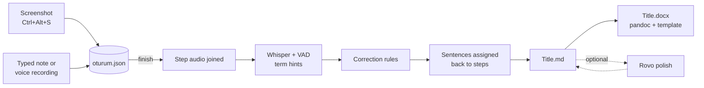

# adımadım

**English** · [Türkçe](README.tr.md)

**Click through the screens, talk as you go, and walk away with a finished use-case document.**

adımadım ("step by step" in Turkish) is a local desktop tool for business analysts who write
use-case scenarios. You move through an application screen by screen; at each step you take a
screenshot and describe it by typing or speaking. When you finish, the screenshots and narration
become an ordered **Markdown** document and a **Word (.docx)** file.

Everything runs on your machine. Screenshots, notes and voice recordings never leave it; the
internet is used only during installation to download packages and the speech model.

## Why it exists

Writing a use-case scenario by hand means taking screenshots, pasting them into a document and
describing every step, then cleaning it all up. adımadım turns that into a single pass: you
demonstrate the flow once and narrate it. The hard part is speech recognition: the narration is in
Turkish but full of English telecom/BSS terms ("Device Upgrade", "Order Summary", "SIM swap"),
which general speech models get wrong. Much of the project is about measuring and fixing that.

## What you get

A session folder with the screenshots, the recordings and the document:

```
Belgeler/adimadim/Sipariş iptal akışı/
├── oturum.json                 # session source of truth
├── gorseller/adim-01.png …     # screenshots (originals kept in .orijinal/ after editing)
├── ses/                        # voice recordings, one per step
├── Sipariş iptal akışı.md
└── Sipariş iptal akışı.docx
```

The document follows a use-case template: title, date, placeholders for goal, actor, pre- and
post-conditions, then a **main flow** with one section per step (screenshot plus the typed note
and/or transcribed narration):

```markdown
# Sipariş iptal akışı

- **Tarih:** 2026-09-28
- **Amaç:** …
- **Aktör:** …

## Ana akış

### Adım 1


Müşteri ekranında Order Summary sekmesine geçiyoruz ve iptal edilecek siparişi seçiyoruz.
```

The Markdown works well in Obsidian (it updates live while the session is open). Word output uses
your company template (`sablon.docx`) if one is present.

## The interface

A small, always-on-top window with three screens; no terminal needed.

1. **Start:** enter a title and choose spoken or typed narration.
2. **Recording:** capture the screen, add or fix a note, undo the last capture, capture a region.
   Thumbnails of captured steps, the step count and a recording indicator are shown. Clicking any
   thumbnail opens the **image editor**: crop, box, arrow and text annotations, undo (Ctrl+Z),
   save (Enter).
3. **Finish:** a progress bar while the audio is transcribed, then a preview of the document.
   From here you can copy the Markdown to the clipboard, paste back an AI-polished version
   (Atlassian Rovo) to update both .md and .docx, refresh Word, re-transcribe, or open the folder.

Global shortcuts work from any application: `Ctrl+Alt+S` captures the current window (or full
screen) and asks for its note, `Ctrl+Alt+N` edits the last step's note.

## How it works



- **Speech recognition:** Whisper medium through OpenVINO, running on Intel CPU, GPU or NPU.
  If OpenVINO is unavailable it falls back to faster-whisper. Silero VAD returns nothing for
  silence or keyboard noise instead of letting the model hallucinate text.
- **Domain terms:** a term list is passed to the model as a prompt hint; a "wrong → right"
  correction dictionary is applied afterwards while preserving Turkish suffixes. Company-specific
  terms and corrections live in `.local` files outside the repo.
- **Whole-session transcription:** all step recordings are joined and transcribed at once, and each
  sentence is assigned to the step in which it started. Transcribing step by step lost words at the
  boundaries.
- **Formal wording** is left to Atlassian Rovo; the agent instructions and glossary are in `rovo/`.

## Accuracy

Speech-recognition choices were made by measurement (`testler/stt_olc.py`, `testler/karsilastir.py`):

| Change | Result |
|---|---|
| Model choice (29 real recordings) | whisper-medium term hit rate 66.3% vs. 28.4% and 14.7% for two Turkish fine-tuned models, which wrote English terms phonetically |
| Term hint + corrections + VAD | term hit rate 67.4% → 90.5%, WER 29.0% → 16.4%; general Turkish (FLEURS) not degraded (12.5% → 12.0%) |
| Whole-session transcription (real 12-step session) | WER 93.0% → 7.6%, terms 11/11 |

Details are in `CHANGELOG.md` (Turkish) and `testler/sonuclar/`.

## Installation

Targets Ubuntu 22.04 with Python 3.10. After cloning:

    ./kur.sh     # system packages, Python env, model conversion, command, shortcuts
    ./test.sh    # verifies everything; last line: SONUÇ: testler geçti

`kur.sh` is idempotent and never overwrites existing settings.

## Command line

Open **adımadım** from the application menu, or use the CLI:

    adimadim basla "Sipariş iptal akışı"   # start; add --ses for spoken narration
    adimadim geri                           # delete the last capture
    adimadim bitir                          # build .md + .docx, open the folder
    adimadim word                           # rebuild Word after editing the .md
    adimadim yeniden                        # re-transcribe with the current model
    adimadim cevir kayit.wav                # transcribe a single audio file
    adimadim cek --tam                      # capture the full screen regardless of settings
    adimadim arayuz                         # open the window

Settings are in `~/.config/adimadim/ayar.json` (defaults in `ayar.ornek.json`, documented in
[README.tr.md](README.tr.md#ayarlar)).

## Project layout

| Path | Contents |
|---|---|
| `adimadim.py` | single entry point: commands, speech recognition, .md/.docx generation |
| `arayuz.py` | tkinter window and image editor |
| `kur.sh`, `test.sh` | installation and end-to-end tests |
| `terimler.txt`, `duzeltmeler.txt` | general term list and correction dictionary |
| `rovo/` | Rovo agent instructions and Confluence glossary |
| `testler/` | smoke test, WER measurement, model comparison, test recordings |
| `beceriler/vm-ana-makine/` | Claude Code skill for the develop-in-VM, run-on-host workflow |

The project is developed with Claude Code in a VM and reaches the machine where it is used only
through tagged git releases (`git pull && ./kur.sh && ./test.sh`). Rules, decisions and the
roadmap are in `CLAUDE.md`, `KARARLAR.md` and `YOL_HARITASI.md` (Turkish).

## Development history

How the product evolved, one entry per release. From now on each pull request adds a row here.

| Version | Date | What changed |
|---|---|---|
| v0.1.0 | 2026-09 | Skeleton: screenshots + typed/spoken narration → .md + .docx. OpenVINO speech recognition with faster-whisper fallback, reproducible `kur.sh`/`test.sh`, VM ↔ host workflow. |
| v0.3.0 | 2026-09-27 | Model decision: whisper-medium stays (Turkish fine-tunes rejected). Accuracy layers: VAD, term hints, correction rules. Rovo agent instructions and glossary. Fixed a locale bug that silently broke the OpenVINO model. |
| v0.3.1 | 2026-09-27 | Relative document folder resolved correctly from the keyboard shortcut. |
| v0.4.0 | 2026-09-28 | Whole-session transcription with sentences assigned back to steps: WER 93% → 7.6% on a real session. |
| v0.4.1 | 2026-09-28 | Word rebuilt from pasted Rovo output with screenshots and step headings restored. |
| v0.5.0 | 2026-09-28 | Button window: the whole flow without a terminal; application menu entry. |
| v0.6.0 | 2026-09-28 | Window redesigned into Start → Recording → Finish screens, with progress bar and thumbnails. |
| v0.7.0 | 2026-09-28 | Region capture and image editor (crop, box, arrow, text); copy Markdown and paste-back Rovo area on the finish screen. |
