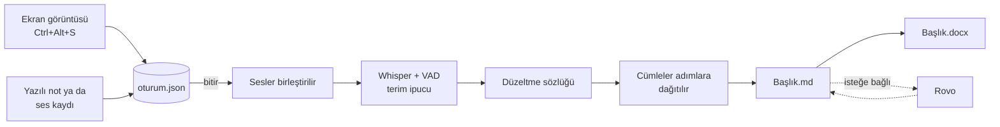

# adımadım

[English](README.md) · **Türkçe**

**Ekranda gezinirken anlat, sonunda kullanım senaryosu dokümanın hazır olsun.**

adımadım, iş analistlerinin kullanım senaryosu yazma işini kısaltan yerel bir masaüstü aracıdır.
Uygulamada ekrandan ekrana ilerlerken her adımda ekran görüntüsü alırsın ve o adımı yazarak ya da
sesle anlatırsın. Oturumu bitirdiğinde görseller ve anlatımlar sıralı bir **Markdown** ve **Word (.docx)**
dokümanına dönüşür.

Her şey makinede çalışır: görüntüler, notlar ve ses kayıtları hiçbir sunucuya gitmez. İnternet
yalnızca kurulumda (paket ve model indirmek için) kullanılır.

## Özellikler

- **Düğmeli pencere:** Başla → Kayıt → Bitiş ekranları; terminal gerekmez. Kayıt ekranında
  çekilen adımların önizlemesi, adım sayısı ve kayıt göstergesi görünür.
- **Kısayolla çekim:** `Ctrl+Alt+S` o anki ekranı (ya da aktif pencereyi) çeker ve notunu sorar,
  `Ctrl+Alt+N` son adımın notunu düzeltir.
- **Sesle anlatım:** Her adımın sesi kaydedilir; oturum bitince hepsi birlikte metne çevrilir ve
  cümleler başladıkları adıma dağıtılır.
- **Türkçe konuşma tanıma, yerelde:** Whisper (medium) OpenVINO ile Intel CPU/GPU/NPU'da çalışır;
  OpenVINO kullanılamazsa kendiliğinden faster-whisper'a düşer. Silero VAD sessiz kayıtları eler.
- **Alan terimlerine uyum:** Terim listesi modele ipucu olarak verilir; "yanlış → doğru" düzeltme
  sözlüğü Türkçe ekleri koruyarak çıktıya uygulanır. Şirkete özel terimler repoya girmeyen
  `.local` dosyalarında durur.
- **Görsel düzenleyici:** Önizlemedeki görsele tıkla; kırp, kutu, ok ya da yazı ekle.
  Orijinal görsel ayrıca saklanır.
- **Bölge çekimi:** Tüm ekranı çeker, ardından istediğin alanı kırparsın.
- **Word çıktısı:** Şirket şablonu (`sablon.docx`) varsa onunla üretilir. .md'yi elle düzeltirsen
  `adimadim word` Word'ü ondan yeniler.
- **Rovo ile toparlama:** Bitiş ekranında .md panoya kopyalanır; Atlassian Rovo'nun resmileştirdiği
  metin geri yapıştırılınca .md ve Word güncellenir (önceki sürüm `.md.yedek`'te). Rovo ajanı
  talimatı ve terim sözlüğü `rovo/` klasöründe.

## Nasıl çalışır

Oturum klasöründe `oturum.json` (kaynak), `gorseller/`, `ses/`, `<Başlık>.md` ve `<Başlık>.docx`
bulunur. Oturum açıkken .md her kayıtta yeniden üretilir; bittikten sonra elle düzenlenebilir.

## Doğruluk

Konuşma tanıma kararları ölçümle alındı (`testler/stt_olc.py`, `testler/karsilastir.py`):

- Adımları tek tek değil **toplu çevirmek**, gerçek bir 12 adımlık oturumda kelime hata oranını
  (WER) **%93'ten %7,6'ya** indirdi: adım adım çeviri sınırlarda kelime kaybettiriyordu.
- İki Türkçe ince ayarlı Whisper modeli denendi ve elendi: İngilizce terimleri Türkçe okunuşla
  yazıyorlardı. 29 gerçek kayıtta terim isabeti whisper-medium'da %66,3, adaylarda %28,4 ve %14,7.

Ayrıntılı sonuçlar `CHANGELOG.md` ve `testler/sonuclar/` klasöründe.

## Kurulum

Ubuntu 22.04 ve Python 3.10 hedeflenir. Repoyu klonladıktan sonra:

    ./kur.sh     # sistem paketleri, Python ortamı, model dönüştürme, komut, kısayollar
    ./test.sh    # her şeyin çalıştığını doğrular; son satır: SONUÇ: testler geçti

`kur.sh` tekrar tekrar çalıştırılabilir ve mevcut ayarları ezmez.

## Kullanım

Uygulama menüsünden **adımadım**'ı aç; bütün adımlar düğmelerle yapılır. Komut satırı da aynen çalışır:

    adimadim basla "Sipariş iptal akışı"   # sesle anlatmak için sonuna --ses
    Ctrl+Alt+S                              # her ekranda: görüntü al, notunu yaz / anlat
    Ctrl+Alt+N                              # son adımın notunu düzelt
    adimadim geri                           # yanlış çekimi sil
    adimadim bitir                          # .md + .docx üret, klasörü aç
    adimadim word                           # .md'yi elle düzelttikten sonra Word'ü yenile
    adimadim yeniden                        # ses kayıtlarını güncel modelle baştan çevir
    adimadim cevir kayit.wav                # tek bir ses dosyasını metne çevir
    adimadim cek --tam                      # ayardan bağımsız tüm ekranı çek
    adimadim arayuz                         # düğmeli pencere

## Ayarlar

`~/.config/adimadim/ayar.json` (kur.sh oluşturur, varsayılanlar `ayar.ornek.json`'da):

| Anahtar          | Anlamı                                                          |
|------------------|-----------------------------------------------------------------|
| `klasor`         | dokümanların yeri; boşsa Belgeler/adimadim (ör. Obsidian vault) |
| `ekran`          | `pencere` (aktif pencere) ya da `tam`                           |
| `stt`            | `openvino` (varsayılan) ya da `faster-whisper`                  |
| `cihaz`          | `CPU`, `GPU`, `NPU` (ilk kurulumda otomatik algılanır)          |
| `ov_kaynak`      | dönüştürülecek Whisper modeli                                   |
| `ov_model`       | dönüştürülmüş modelin klasörü                                   |
| `whisper_modeli` | OpenVINO çalışmazsa yedek faster-whisper modeli                 |
| `dil`            | anlatım dili, varsayılan `tr`                                   |
| `ipucu`          | terimleri Whisper'a ipucu olarak ver: `prompt`, `hotwords` ya da boş (kapalı) |
| `duzeltme`       | `duzeltmeler.txt` (+ `.local`) kurallarını çıktıya uygula (`true`/`false`) |

Şirket Word şablonu: `~/.config/adimadim/sablon.docx`.
Şirkete özel terimler: `~/.config/adimadim/terimler.local.txt` (repoya girmez).
Şirkete özel düzeltmeler ("yanlış → doğru"): `~/.config/adimadim/duzeltmeler.local.txt` (repoya girmez).

## Proje yapısı

| Dosya / klasör        | İçerik                                                        |
|-----------------------|---------------------------------------------------------------|
| `adimadim.py`         | tek giriş noktası: komutlar, konuşma tanıma, .md/.docx üretimi |
| `arayuz.py`           | tkinter pencere ve görsel düzenleyici                         |
| `kur.sh`, `test.sh`   | kurulum ve uçtan uca test                                     |
| `terimler.txt`, `duzeltmeler.txt` | genel terim listesi ve düzeltme sözlüğü           |
| `rovo/`               | Rovo ajanı talimatı ve Confluence terim sözlüğü               |
| `testler/`            | duman testi, WER ölçümü, model karşılaştırma, test sesleri    |
| `beceriler/vm-ana-makine/` | VM'de geliştirip ana makinede çalıştırma düzeni (Claude Code becerisi) |

## Geliştirme

Proje, Claude Code ile bir sanal makinede geliştirilir ve ana makineye yalnızca git üzerinden,
etiketli sürümler olarak gider:

    VM:          Claude Code geliştirir → ./test.sh → commit + etiket → push
    Ana makine:  git pull && ./kur.sh && ./test.sh

İlk kurulum, günlük akış ve sorun giderme `CALISMA_DUZENI.md`'de; kurallar `CLAUDE.md`'de,
kararlar ve gerekçeleri `KARARLAR.md`'de, iş planı `YOL_HARITASI.md`'de, sürüm notları `CHANGELOG.md`'de.
