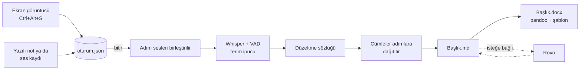

# adımadım

[English](README.md) · **Türkçe**


> **adımadım: ekranlarda gezin, anlat, kullanım senaryosu dokümanın hazır olsun.**

---

## 📌 Proje Hakkında

İş analistleri bir uygulamanın nasıl kullanıldığını kullanım senaryolarıyla anlatır: her ekranın
görüntüsünü alır, dokümana yapıştırır, ne olduğunu yazar, sonra hepsini toparlar. Bu yavaş ve tekrarlı
bir iştir; ekranlarda çoğu zaman bulut hizmetine gönderilemeyecek müşteri verisi vardır. Konuşma tanıma
işi hızlandırabilir, ama anlatım İngilizce telekom/BSS terimleriyle ("Device Upgrade", "Order Summary",
"SIM swap") karışık Türkçedir ve genel modeller bu terimleri yanlış yazar.

adımadım bu işi tek geçişe indirir. Akışı bir kez gösterirsin, her ekranı kısayolla çekip sesle ya da
yazarak anlatırsın; bitirdiğinde sıralı bir Markdown ve Word dokümanı hazırdır. Konuşma tanıma tamamen
makinede çalışır ve alan terimlerine ipucu, düzeltme kuralları ve toplu çeviriyle uyarlanmıştır; her
adım tahminle değil ölçümle seçilmiştir.

## ✨ Temel Özellikler

* **Tek kısayolla çekim:** `Ctrl+Alt+S` her uygulamadan aktif pencereyi (ya da tüm ekranı) çeker ve adımın notunu sorar; `Ctrl+Alt+N` son notu düzeltir.
* **Yerelde çevrilen sesli anlatım:** Whisper medium, OpenVINO ile Intel CPU/GPU/NPU'da; çalışmazsa kendiliğinden faster-whisper. Hiçbir veri makineden çıkmaz.
* **Alan terimlerinde doğruluk:** terim ipucu, Türkçe eki koruyan "yanlış → doğru" sözlüğü ve Silero VAD terim isabetini %67'den %90'a çıkarır. Şirkete özel terimler repo dışındaki `.local` dosyalarında durur.
* **Toplu çeviri:** tüm adım sesleri birlikte çevrilir, her cümle kendi adımına dağıtılır; gerçek bir oturumda WER %93'ten %7,6'ya indi.
* **Görsel düzenleyici:** her görselde kırp, kutu, ok, yazı; orijinal saklanır.
* **Adım adım API çağrıları:** tarayıcının Ağ kaydı HAR olarak verilince her JSON/XML çağrı ait olduğu adıma yazılır (GET → verinin göründüğü ekran, POST/PUT/DELETE → butonuna basılan ekran); jeton, çerez ve ayardaki alanlar maskelenir. İş akışı komut tablosu (DBeaver kopyası ya da CSV/TXT) yüklenince her iş akışı çağrısının altında çalışan komutlar da listelenir: mevcut durumun post, sonraki durumun pre komutları.
* **Doküman çıktısı:** Markdown (Obsidian'da canlı) ve pandoc ile, varsa şirket şablonuyla Word; Rovo'nun resmileştirdiği metin geri yapıştırılınca iki dosya da güncellenir.

## 🛠 Teknolojik Altyapı

* **Dil:** Python 3.10 (tek giriş noktası `adimadim.py`), Bash (`kur.sh`, `test.sh`)
* **Arayüz:** tkinter (hep üstte pencere), Pillow (görsel düzenleyici), zenity ve libnotify (pencereler, bildirimler), GNOME kısayolları
* **Konuşma / YZ:** OpenAI Whisper medium; optimum-intel 2.2 ile dönüştürülüp OpenVINO GenAI 2026.4 ile çalıştırılır; yedek faster-whisper; Silero VAD; resmi dil için Atlassian Rovo (isteğe bağlı, aracın dışında)
* **Veri:** yalnızca dosyalar: oturum başına `oturum.json`, PNG görseller, WAV kayıtlar, Markdown ve DOCX
* **Sistem:** gnome-screenshot, arecord (ALSA), pandoc

## 🏗 Sistem Mimarisi ve Çalışma Mantığı



1. **Çekim:** her kısayol ya da düğme bir görsel kaydeder; sesli modda önceki adımın kaydını kapatıp yenisini başlatır. Tek kaynak `oturum.json`'dur; .md her değişiklikte ondan yeniden üretilir.
2. **Çeviri:** bitirince adım sesleri birleştirilir. Silero VAD sessizlikleri atar (zaman damgaları asıl sese geri taşınır), Whisper terim listelerinden kurulan ipucuyla çevirir, düzeltme sözlüğü uygulanır.
3. **Dağıtım:** zaman damgalı her cümle başladığı adıma yazılır.
4. **Üretim:** kullanım senaryosu şablonunda Markdown, ardından pandoc ve şirket şablonuyla Word.
5. **Toparlama (isteğe bağlı):** .md Rovo'ya kopyalanır; geri yapıştırılan resmi metin .md'nin yerine geçer (öncekisi `.md.yedek`), görseller ve adım başlıkları geri konur, Word yenilenir.

Pencere (`arayuz.py`) aynı komutları alt süreçte çalıştırır ve `oturum.json`'u yoklar; komut satırı ve
pencere her zaman aynı davranır.

## 🚀 Hızlı Başlangıç ve Kurulum

**Gereksinimler:** Ubuntu 22.04 (GNOME), Python 3.10, git, `apt-get` için sudo. Intel GPU/NPU isteğe bağlı.

```bash
git clone https://github.com/miracmenekse/adimadim.git
cd adimadim
./kur.sh     # apt paketleri, Python ortamı, Whisper → OpenVINO dönüşümü, komut, kısayollar, menü girdisi
./test.sh    # uçtan uca kontrol; son satır: SONUÇ: testler geçti
```

Ortam değişkeni gerekmez; ayarlar aşağıda. `kur.sh` tekrar çalıştırılabilir ve mevcut değerleri ezmez.
Güncellemek için: `git pull && ./kur.sh && ./test.sh` ya da ana makinede `kur.sh`'nin dock'a eklediği
**adımadım güncelle** düğmesi (çeker, değiştiyse kurar, pencereyi açar). İki makineli (VM'de geliştir, ana makinede
kullan) düzenin kurulumu: [CALISMA_DUZENI.md](CALISMA_DUZENI.md).

## Ayarlar

`~/.config/adimadim/ayar.json` (kur.sh oluşturur, varsayılanlar `ayar.ornek.json`'da):

| Anahtar          | Anlamı                                                          |
|------------------|-----------------------------------------------------------------|
| `klasor`         | dokümanların yeri; boşsa Belgeler/adimadim (ör. Obsidian vault) |
| `ekran`          | `pencere` (aktif pencere) ya da `tam`                           |
| `stt`            | `openvino` (varsayılan) ya da `faster-whisper`                  |
| `cihaz`          | `CPU`, `GPU`, `NPU` (ilk kurulumda otomatik algılanır)          |
| `ov_kaynak`      | dönüştürülecek Whisper modeli                                   |
| `ov_model`       | dönüştürülmüş modelin klasörü                                   |
| `whisper_modeli` | OpenVINO çalışmazsa yedek faster-whisper modeli                 |
| `dil`            | anlatım dili, varsayılan `tr`                                   |
| `ipucu`          | terimleri Whisper'a ipucu olarak ver: `prompt`, `hotwords` ya da boş (kapalı) |
| `duzeltme`       | `duzeltmeler.txt` (+ `.local`) kurallarını çıktıya uygula (`true`/`false`) |
| `api_filtre`     | yalnızca URL'sinde bu parçalardan biri geçen API çağrıları (ör. `["/api/"]`); boşsa JSON/XML olanlar |
| `api_gizle`      | gövde ve sorguda adında bunlardan biri geçen alanlar `***` yazılır (varsayılan: password, parola, sifre, token, secret) |

Şirket Word şablonu: `~/.config/adimadim/sablon.docx`.
Şirkete özel terimler: `~/.config/adimadim/terimler.local.txt` (repoya girmez).
Şirkete özel düzeltmeler ("yanlış → doğru"): `~/.config/adimadim/duzeltmeler.local.txt` (repoya girmez).

## 💡 Kullanım Senaryoları

Uygulama menüsünden **adımadım**'ı aç: **Başla** (ad, sesli/yazılı) → **Kayıt** (çek, not, geri al,
bölge çek, önizlemeler) → **Bitiş** (bekleme çubuğu, doküman önizlemesi, MD'yi kopyala, Rovo alanı,
Word'ü aç, HAR'dan API ekle). Ya da komut satırı:

```bash
adimadim basla "Sipariş iptal akışı" --ses   # sesli oturum başlat
# her ekranda Ctrl+Alt+S'ye bas ve anlat
adimadim geri                                 # son çekimi sil
adimadim bitir                                # çevir, .md + .docx üret, klasörü aç
adimadim word                                 # .md'yi elle düzelttikten sonra Word'ü yenile
adimadim yeniden                              # güncel modelle baştan çevir
adimadim cevir kayit.wav                      # tek bir ses dosyasını çevir
adimadim api akis.har                         # tarayıcının Ağ kaydındaki API çağrılarını ekle
adimadim komutlar tablo.csv                   # komut tablosunu yükle: her iş akışı çağrısında çalışanlar
adimadim cek --tam                            # ayardan bağımsız tüm ekranı çek
```

**API çağrıları (Firefox):** ilk ekrandan önce F12 → **Ağ** sekmesini aç, dişliden **Kayıtları sürdür**'ü işaretle.
Bitirince Ağ sekmesinde sağ tık → **Tümünü HAR olarak kaydet**, sonra Bitiş ekranında **API ekle (HAR)**
(Rovo'dan önce: .md yeniden üretilir, öncekisi `.md.yedek`). Başlıklar (Authorization, Cookie) dokümana hiç yazılmaz;
HAR dosyası oturum klasörüne kopyalanmaz, içinde oturum çerezi olduğu için işin bitince sil.

**Çalışan komutlar:** DBeaver'da komut tablosu sorgusunun sonucunda Ctrl+A, Ctrl+C, sonra Bitiş ekranında
**Komut tablosu** (pano boşsa CSV/TXT/Markdown dışa aktarımını seçtirir). Sütunlar: akış, durum, …,
bean_name, is_pre, is_post, sort_id. Yalnızca bu dokümanın akışının satırları olmalı. İstek/yanıt gövdeleri
kısaltılmadan (maskelenerek) yazılır.

**Çıktı:** bir oturum klasörü

```
Belgeler/adimadim/Sipariş iptal akışı/
├── oturum.json
├── gorseller/adim-01.png …
├── ses/
├── Sipariş iptal akışı.md
└── Sipariş iptal akışı.docx
```

ve şöyle bir doküman:

```markdown
# Sipariş iptal akışı

- **Tarih:** 2026-09-28
- **Amaç:** …
- **Aktör:** …

## Ana akış

### Adım 1


Müşteri ekranında Order Summary sekmesine geçiyoruz ve iptal edilecek siparişi seçiyoruz.
```

**Ölçülen doğruluk** (`testler/stt_olc.py`, `testler/karsilastir.py`; ayrıntı `CHANGELOG.md` ve `testler/sonuclar/`):

| Değişiklik | Sonuç |
|---|---|
| Model seçimi (29 gerçek kayıt) | terim isabeti whisper-medium %66,3; iki Türkçe ince ayarlı model %28,4 ve %14,7 |
| Terim ipucu + düzeltme + VAD | terim isabeti %67,4 → %90,5, WER %29,0 → %16,4; genel Türkçede (FLEURS) bozulma yok |
| Toplu çeviri (12 adımlık gerçek oturum) | WER %93,0 → %7,6, terimler 11/11 |

## 🗺 Yol Haritası

- [x] Ekran görüntüsü + yazılı/sesli anlatım → Markdown + Word
- [x] Alan terimlerine uyarlanmış yerel Türkçe konuşma tanıma
- [x] Düğmeli pencere, görsel düzenleyici, Rovo alanı
- [x] Tarayıcının HAR kaydından adım adım API çağrıları
- [x] Komut yapılandırma tablosundan her iş akışı çağrısında çalışan komutlar
- [ ] Oturumu bitirmek için klavye kısayolu
- [ ] Sesli modda kayıt süresini gösteren gösterge
- [ ] Windows desteği (değerlendiriliyor; ekran çekme, kısayollar ve ses kaydı bugün Linux'a bağlı)

Ayrıntılı plan ve kararlar: `YOL_HARITASI.md`, `KARARLAR.md`.

## 📄 Lisans ve Katkıda Bulunma

Henüz lisans seçilmedi; eklenene kadar tüm hakları saklıdır.

Proje Claude Code ile bir VM'de geliştirilir ve kullanıldığı makineye yalnızca etiketli sürümlerle
gider. Katkı kuralları: her değişiklik `./test.sh`'den geçer; her yeni özellik `testler/duman_testi.py`'ye
kontrol ekler; doğruluğu etkileyen değişiklik önce ve sonra ölçülür; repoya gerçek şirket verisi girmez.
Ayrıntı: `CLAUDE.md`, `CALISMA_DUZENI.md`.

## 📈 Geliştirme Geçmişi

Ürünün nasıl geliştiği, her sürüm için bir satır. Her PR buraya bir satır ekler.

| Sürüm | Tarih | Ne değişti |
|---|---|---|
| v0.1.0 | 2026-09 | İskelet: ekran görüntüsü + yazılı/sesli anlatım → .md + .docx. OpenVINO konuşma tanıma ve faster-whisper yedeği, tekrarlanabilir `kur.sh`/`test.sh`, VM ↔ ana makine düzeni. |
| v0.3.0 | 2026-09-27 | Model kararı: whisper-medium kaldı (Türkçe modeller elendi). Doğruluk katmanları: VAD, terim ipucu, düzeltme kuralları. Rovo talimatı ve sözlüğü. OpenVINO modelini sessizce bozan locale hatası düzeltildi. |
| v0.3.1 | 2026-09-27 | Göreli doküman klasörü kısayoldan da doğru çözülüyor. |
| v0.4.0 | 2026-09-28 | Toplu çeviri, cümleler adımlarına dağıtılıyor: gerçek oturumda WER %93 → %7,6. |
| v0.4.1 | 2026-09-28 | Rovo çıktısından Word; görseller ve adım başlıkları geri konuyor. |
| v0.5.0 | 2026-09-28 | Düğmeli pencere: terminalsiz kullanım, uygulama menüsü girdisi. |
| v0.6.0 | 2026-09-28 | Pencere Başla → Kayıt → Bitiş ekranlarına ayrıldı; bekleme çubuğu ve önizlemeler. |
| v0.7.0 | 2026-09-28 | Bölge çekme ve görsel düzenleyici (kırp, kutu, ok, yazı); bitiş ekranında MD'yi kopyala ve Rovo alanı. |
| v0.8.0 | 2026-10-06 | Adım adım API çağrıları: tarayıcının Ağ kaydı (HAR) ekran çekimleriyle zamandan eşlenir; tablo ve kısaltılmış, maskeli istek/yanıt gövdeleri. |
| v0.9.0 | 2026-10-07 | İş akışında çalışan komutlar: komut yapılandırma tablosu (DBeaver kopyası, CSV, TXT, Markdown) iş akışı çağrılarıyla mevcut/sonraki durum ve pre/post bayraklarına göre eşlenir. |
| v0.9.1 | 2026-10-07 | Ana makinede tek tıkla güncelleme: dock'taki "adımadım güncelle" düğmesi son kodu çeker, yalnızca değiştiyse yeniden kurar ve pencereyi açar. |
| v0.9.2 | 2026-10-07 | API istek/yanıt gövdeleri kısaltılmadan tam yazılır; maskeleme aynı. |
